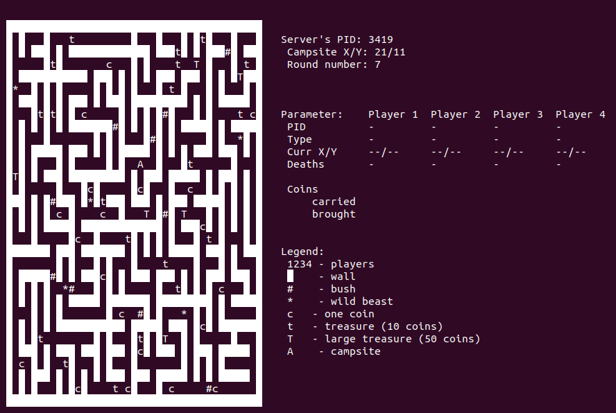
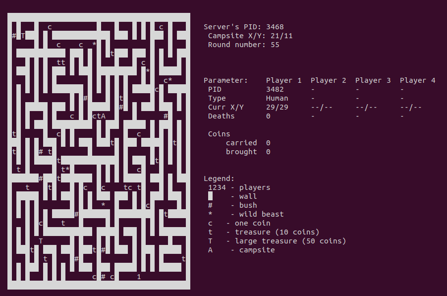
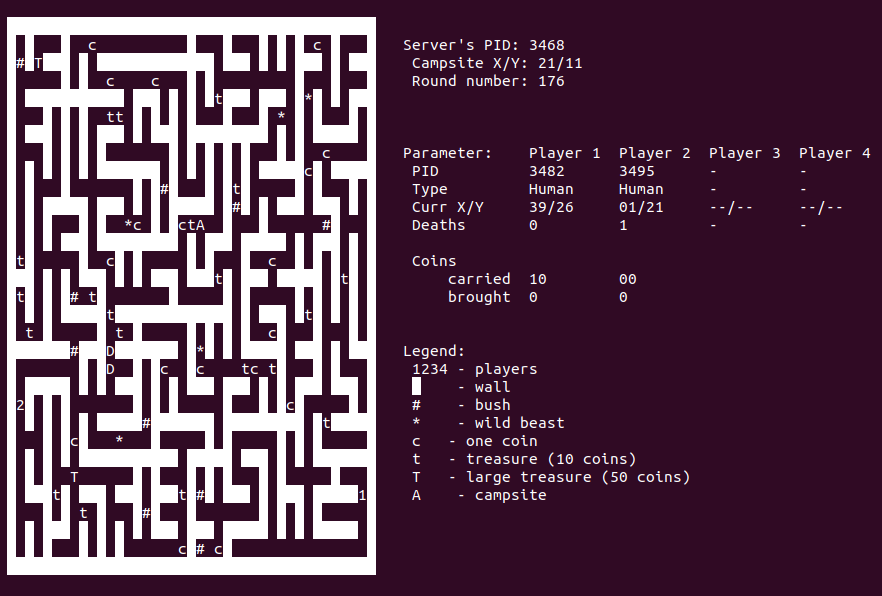
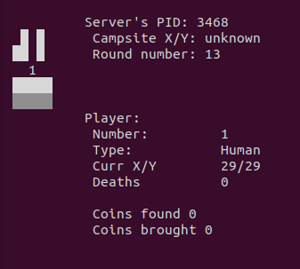
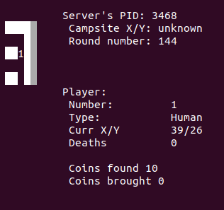
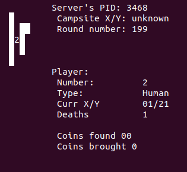

# IPC Multiplayer Game
Packman-like game made by using IPC, curses library and C programming language
## View
### Server
  
### Clients
  
## Server
* type `b` to generate new beast
* type `c`, `t` or `T` to generate new type of treasure
* type `q` to quit the server
## Client
* `w` `a` `s` `d` for moving
* `q` to quit the game
* max 4 clients
* client dies after a collision with a beast
* drop the treasure after death and respawns at initial coordinates
* campsite `A` stores the treasure
* bushes `#` slow the client down for 1 turn  
## Tools
* FIFO queue
* Threads
* Mutexes
* Curses Terminal Control Library
